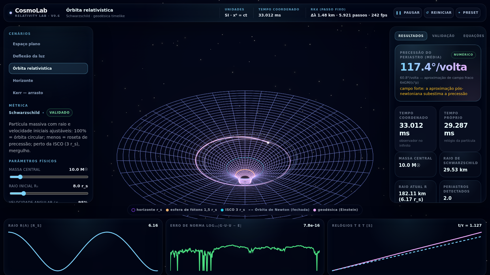
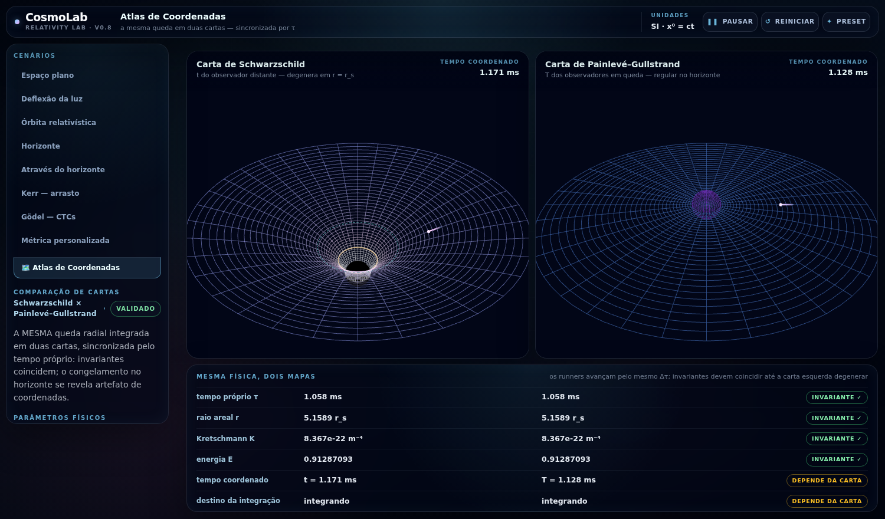
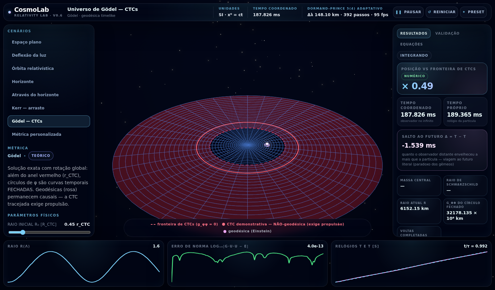

# CosmoLab — a general relativity laboratory in your browser

> **The place where anyone can see, measure, compare and verify how spacetime steers matter and light.**

CosmoLab is not only a black-hole visualizer. Its scientific trajectories come from numerical
integration of the full geodesic equation on an explicit spacetime metric — with integration
error, applicable Killing constants, and the epistemic status of displayed observables exposed
on screen. Interface in Portuguese and English (`🌐` toggle, or `?lang=en`).



## What makes it different

- **Full equations, numerically integrated** — geodesics evolved by adaptive Dormand–Prince 5(4)
  (or fixed RK4) on Minkowski, Schwarzschild, Painlevé–Gullstrand, Kerr, Gödel, FLRW and
  **user-defined metrics** typed as `g_μν` expressions in the built-in editor. “Full” means that
  the engine does not replace strong-field dynamics with a weak-field formula; it does not mean
  zero discretization or floating-point error.
- **Honesty as interface** — every value carries its provenance (*numeric / analytic /
  weak-field*), every scenario carries a scientific status (*validated / theoretical /
  speculative*), regime warnings fire when approximations stop being trustworthy, and the live
  validation panel shows norm error, Killing-constant drift, Ricci ≈ 0 vacuum checks and the
  Kretschmann invariant.
- **The Coordinate Atlas** — the same fall integrated in two charts side by side, synchronized by
  proper time: invariants (τ, areal r, K, E) agree within numerical tolerance while coordinate
  quantities differ. The Schwarzschild-time horizon “freeze” is revealed as a chart effect.
- **The spacetime price tag** — where a valid local orthonormal tetrad can be built, the engine
  computes the Einstein tensor and the corresponding effective stress-energy tensor. It samples
  the Null Energy Condition over 134 null directions: a negative value beyond tolerance is a
  numerical witness subject to tensor-convergence checks, while not finding one is explicitly
  reported as a sampling result, not an analytic proof.
- **The four classical tests, student-verifiable** — Eddington's light deflection (1.75″),
  Mercury-style periastron precession, gravitational time dilation and the Shapiro delay.
- **Discovery missions** — engine-verified challenges (reproduce Eddington 1919; find the edge of
  orbital stability; trap a photon just below the critical impact parameter), with persistent
  medals.
- **Reproducible science** — every experiment has an ID; export JSON/CSV or a one-click printable
  **lab report**; every configuration (custom metrics included) lives in the URL.



## Validation

The engine is validated in three layers (see [docs/VALIDATION.md](docs/VALIDATION.md)):

| Layer | Result |
|---|---|
| **Cross-check vs einsteinpy** (independent Python engine) | periastron-precession observable **262.1508° vs 262.1514°/orbit — 2 ppm** in deep strong field (periastron at 2.7 r_s); pointwise orbit-shape differences are separately reported at ~10⁻⁴ |
| **75 automated tests** (scientific core + reporting/i18n regressions) | light deflection 4GM/c²b to 1%, Ω² = GM/r³ to 10⁻⁴, RK4 4th-order convergence (Richardson), local orbital-speed semantics, Kretschmann closed forms (Schwarzschild, Reissner–Nordström *through the plugin editor*), PG horizon regularity, sampled NEC and Morris–Thorne exotic density, FLRW/Friedmann reconstruction, and more |
| **Continuous in-app diagnostics** | norm \|g·u·u − ε\| always; E/L drift only when the corresponding temporal/axial symmetries exist; local curvature scalars, sampled axial CTC and matter/NEC diagnostics with their domains of applicability |

## Quickstart

```bash
npm install
npm run dev     # open the printed URL (LAN-exposed for WSL2)
npm test        # 75 automated tests
npm run build
```

## Architecture (physics never touches the renderer)

```
physics/      pure math: metrics (plugin interface), Christoffels (analytic or
              finite-difference), geodesics, curvature invariants, Einstein tensor,
              causality, circular orbits, embeddings — zero React/Three imports
simulation/   integrators (RK4, DP5(4) adaptive), scenario definitions, runner,
              observables, missions, metric passport — zero React/Three imports
rendering/    coordinate/embedding mapping, Flamm geometry buffers
components/   React + react-three-fiber: draw what the engine produced, never compute
```

Any new geometry only implements the `SpacetimeMetric` interface — Kerr, Painlevé–Gullstrand and
Gödel all entered as pure plugins (no analytic Christoffels needed).



---

# CosmoLab — um laboratório de relatividade geral no navegador (PT-BR)

> **O lugar onde qualquer pessoa pode ver, medir, comparar e verificar como o espaço-tempo conduz
> matéria e luz.**

O CosmoLab não é apenas um visualizador de buracos negros: suas trajetórias científicas vêm da
integração numérica da equação geodésica completa em uma métrica explícita — com erro numérico,
constantes de Killing quando aplicáveis e o status epistêmico de cada observável **exibidos na
tela**.

- **Equações completas, integração numérica**: Minkowski, Schwarzschild,
  Painlevé–Gullstrand, Kerr, Gödel, FLRW e métricas **definidas pelo usuário** no editor de g_μν;
- **Honestidade como interface**: proveniência (numérico/analítico/campo fraco), status
  científico por cenário, avisos de regime e validação numérica contínua;
- **Atlas de Coordenadas**: a mesma queda em duas cartas, sincronizada por τ — invariantes
  coincidem dentro da tolerância numérica, o "congelamento" no horizonte se revela artefato do mapa;
- **Etiqueta de preço do espaço-tempo**: tensor de Einstein → tensor energia-momento efetivo;
  violações da NEC fornecem direções-testemunha numéricas quando encontradas além da tolerância,
  enquanto resultados positivos são declarados como amostragem de 134 direções nulas;
- **Os quatro testes clássicos** verificáveis pelo aluno + **missões de descoberta** corrigidas
  pelo motor, com medalhas persistentes;
- **Reprodutibilidade**: ID de experimento, exportação JSON/CSV, **relatório de laboratório**
  imprimível e URL que reconstrói tudo — inclusive métricas personalizadas.

Validação em três camadas ([docs/VALIDATION.md](docs/VALIDATION.md)): cross-check independente
contra o einsteinpy com concordância de **2 ppm no observável de precessão** em campo forte
(diferenças da forma orbital ~10⁻⁴); **75 testes automatizados** (núcleo científico mais
regressões de relatório/i18n); e diagnósticos contínuos no app com hipóteses de aplicabilidade
explícitas.

## Citação

Se o CosmoLab for útil no seu ensino ou pesquisa, cite-o (ver [CITATION.cff](CITATION.cff)).
